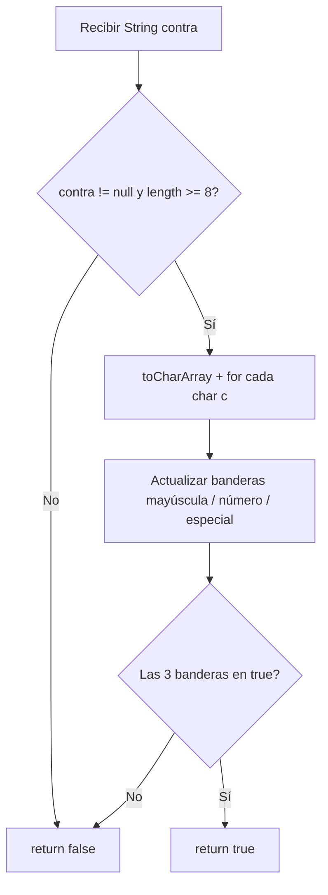

import Callout from '../../components/Callout.astro';
import YouTubeEmbed from '../../components/YouTubeEmbed.astro';

<YouTubeEmbed
  videoId="kQ16JMaC9JM"
  title="Resuelvo ejercicio de Java en NetBeans 2026 (con lógica y buenas prácticas)"
  caption="Video: validador de contraseñas en Java — requisitos del cliente, banderas booleanas y buenas prácticas"
/>

<Callout type="info" title="Enfoque del ejercicio">
  No se trata solo de “hacer que compile”. El equipo de **seguridad** pide un validador para el **login**, y como desarrollador conviene entender el **contexto de negocio**, ir un paso más allá del enunciado mínimo y construir una solución mantenible — sobre todo en 2026, donde la IA puede generar código, pero el valor está en **analizar, decidir y resolver**.
</Callout>

## Resuelvo ejercicio de Java en NetBeans: validador de contraseñas

En este tutorial resolvemos un caso real de empresa: implementar un **verificador de contraseñas** para el login. Lo hacemos en **NetBeans** con un proyecto **Maven Web Application**, en Java, con lógica clara y buenas prácticas que podés reutilizar en entrevistas y en el día a día.

---

## Requisitos del cliente (login / seguridad)

La contraseña debe cumplir **cuatro reglas**:

| # | Requisito |
|---|-----------|
| 1 | Mínimo **8 caracteres** |
| 2 | Al menos **una letra mayúscula** |
| 3 | Al menos **un número** o **un carácter especial** (una de las dos alcanza) |
| 4 | (Implícito) El valor recibido no debe tratarse como válido si viene **null** o no cumple lo anterior |

<Callout type="info" title="Número o especial">
  En el video se modelan **dos banderas** (`esNumero` y `esEspecial`) y al final se exigen ambas en `true` para practicar el recorrido. Si el negocio pide estrictamente **número o especial**, la condición final puede ser `esMayuscula && (esNumero || esEspecial)` en lugar de `&& esEspecial` obligatorio.
</Callout>

<Callout type="tip" title="Más allá del enunciado (soft skills)">
  Podrías copiar el texto y pedírselo a una IA; por eso, como junior, suma valor **preguntar**: ¿falta un quinto requisito? ¿La política de seguridad de la empresa pide otra cosa? No hace falta implementarlo todo hoy, pero **pensar en negocio** te diferencia de quien solo pega código.
</Callout>

---

## Proyecto en NetBeans con Maven

1. **File → New Project**
2. Categoría **Java with Maven** → **Web Application**
3. Nombre del proyecto (ejemplo: `MavenProject1`) y **Finish**

La raíz del proyecto Maven es donde vive el código. Para ordenar ejercicios futuros, creá un paquete y dentro una clase:

- Paquete: el que uses en tu proyecto (ejemplo `com.ejercicios`)
- Clase: `ValidarContras` (convención **PascalCase** en nombres de clase)

Eliminá los comentarios autogenerados de NetBeans si no los necesitás.

---

## Método que devuelve true o false (no solo void)

El validador debe poder usarse después como **bandera** en otras partes del login. Por eso el método retorna `boolean`:

```java
public static boolean validarContras(String contra) {
    // lógica de validación
}
```

- **`String contra`**: la contraseña (en inglés `password` es lo habitual; `contra` es válido si el equipo lo usa consistente).
- **`boolean`**: `true` si cumple todo, `false` si no.

<Callout type="warning" title="Buena práctica: nombres en inglés">
  En código profesional suele usarse inglés (`password`, `isValid`). Evitá la **ñ** y caracteres raros en identificadores: en algunos contextos generan bugs sutiles. Acostumbrate desde el principio.
</Callout>

---

## Probar desde el main (consola)

En la clase principal (`Main` o similar) definís una contraseña de prueba y llamás al método:

```java
String contra = "Suscribete2026!";

boolean resultado = ValidarContras.validarContras(contra);
System.out.println("Resultado: " + resultado);
```

En la práctica la contraseña **no** viene fija en el código: la manda el **frontend** o un **servicio** y vos la recibís como parámetro. Para aprender, el `String` estático en `main` alcanza; el concepto es el mismo: **entrada → validar → true/false**.

Si NetBeans marca error al llamar `validarContras`, usá **Ctrl + Espacio** para importar la clase o asegurate de que el método esté en el paquete correcto. **Ctrl + S** y **Run** para ver la salida en consola.

---

## Paso 1: null y longitud mínima

Asumí que el cliente **está equivocado hasta que se demuestre lo contrario**: empezá validando lo básico.

```java
if (contra != null && contra.length() >= 8) {
    // acá seguís con mayúscula, número y especial
} else {
    System.out.println("Tu contraseña es incorrecta o los datos están mal generados.");
    return false;
}
```

- **`contra != null`**: evita `NullPointerException` si el front no envió valor.
- **`contra.length() >= 8`**: cumple el requisito de longitud.

---

## Paso 2: convertir el String en caracteres (toCharArray)

Para revisar **cada carácter** necesitás recorrer la cadena. Un `String` no es un arreglo de letras sueltas; lo convertís con:

```java
for (char c : contra.toCharArray()) {
    // analizar cada c
}
```

Ejemplo: `"Suscribete2026!"` tiene varios caracteres; el `for` ejecuta una vuelta por cada uno (`S`, `u`, `s`, …).

---

## Paso 3: banderas booleanas (flags)

En lugar de asumir que ya cumple mayúscula/número/especial, creá **banderas** en `false` y pasalas a `true` cuando encuentres **al menos un** carácter que cumpla:

```java
boolean esMayuscula = false;
boolean esNumero = false;
boolean esEspecial = false;
```

- Con **una** mayúscula alcanza → `esMayuscula = true`.
- Igual para dígito y para especial.

Dentro del `for`:

```java
if (Character.isUpperCase(c)) {
    esMayuscula = true;
}
if (Character.isDigit(c)) {
    esNumero = true;
}
```

Para **carácter especial**, definí un conjunto explícito (la máquina no “sabe” qué es especial para vos):

```java
String especiales = "!@#$%^&*()_+-=[]{}|;:',.<>?/";
if (especiales.indexOf(c) >= 0) {
    esEspecial = true;
}
```

`indexOf(c) >= 0` significa: “este carácter está en la lista de especiales permitidos”.

---

## Paso 4: validar las tres banderas y retornar

En el video se validan las tres banderas por separado. Si tu regla de negocio es “número **o** especial”, usá `(esNumero || esEspecial)` en lugar de exigir las dos. Ejemplo al estilo del ejercicio en consola:

```java
if (esMayuscula && esNumero && esEspecial) {
    System.out.println("Tu contraseña es correcta.");
    return true;
} else {
    System.out.println("Tu contraseña es incorrecta. Datos incorrectos.");
    return false;
}
```

Ajustá el mensaje según tu producto; lo importante es **un solo punto de retorno claro** con `true` / `false` para reutilizar en el login.

---

## Error típico: variable declarada dentro del if

Si declarás `boolean contraValida = false` **dentro** de un `if` y al final hacés `return contraValida` **fuera** de ese bloque, Java marca error de alcance (**scope**): la variable “vive” solo dentro del `if`.

**Solución:** declará `contraValida` al **inicio** del método `validarContras`, actualizala cuando corresponda y al final:

```java
return contraValida;
```

Así el `return` y la bandera están en el **mismo nivel** del método.

---

## Resumen del flujo



---

## Qué llevarte para el próximo ejercicio

- Leer **requerimientos** como problema de negocio, no solo como lista de `if`.
- Validar **null** y longitud antes de recorrer caracteres.
- Usar **banderas** para “¿al menos uno cumple?” sin recorrer de más.
- Métodos que **retornan boolean** para integrar con login u otras capas.
- Cuidar el **scope** de variables al usar `return`.

Si querés más ejercicios resueltos así (Java, lógica y buenas prácticas), el canal sigue con propuestas similares en video.

---

## Próximos pasos

- Replicá el ejercicio en tu propio proyecto Maven en NetBeans.
- Probá contraseñas inválidas: corta, sin mayúscula, sin número ni especial, y `null` (en test).
- Explorá más guías en [Java](/java/) o [SQL](/sql/) según el stack que estés practicando.
